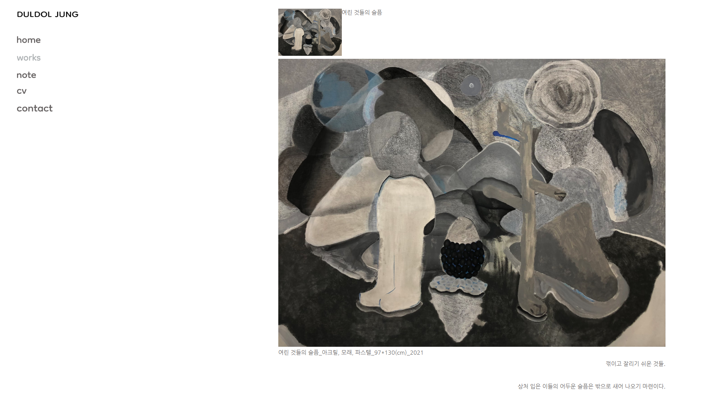
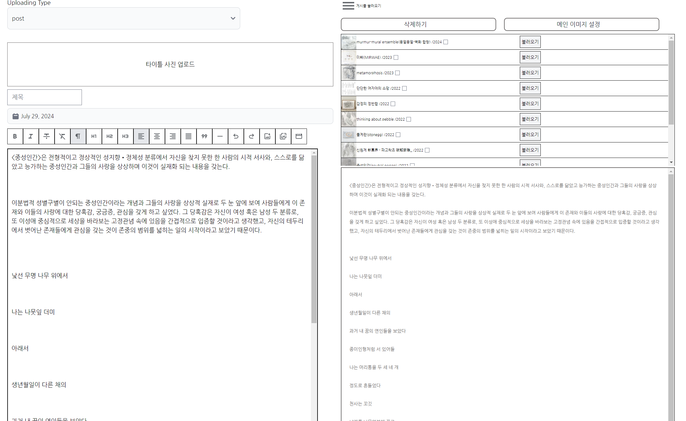

# duldoljimi.com

정들돌 작가 포트폴리오 웹 사이트

## 기술 스택
* React + Vite + Vercel
* Tailwind CSS

* Tiptap Editor

## 설명
예술 작가 포트폴리오 사이트 제작 프로젝트

적은 예산으로 게시물 포스팅이 가능한 것을 목표로 둔 프로젝트입니다.

tiptap editor로 나온 output html 파일을 git 레포지토리에 덮어쓰거나 생성하는 구조로, DB 역할의 파일들은 Json 파일로 저장됩니다.

서버리스보다 더 저수준 단계의 구조를 구현 방향으로 설계하였습니다.